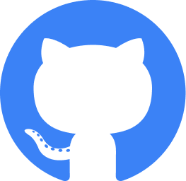

<h1 align="center">Hi, I'm Wassim Ben Amor 👋</h1>

  &#8287;&#8287;&#8287;&#8287;&#8287;
  
  &#8287;&#8287;&#8287;&#8287;&#8287;
  
  &#8287;&#8287;&#8287;&#8287;&#8287;
  
  &#8287;&#8287;&#8287;&#8287;&#8287;
  

## 💁‍♂️ About me

- 🧑‍💻 I am a `Senior Software Engineer` at [Contentsquare](https://contentsquare.com/)
- 🎓 `Software Engineering degree` from [INSAT](https://insat.rnu.tn/) in 2018
- 🌟 Favorite topics: `TypeScript`, `Node.js`, `React`, `Next.js`, `Angular`, `DevOps`, `Micro Frontends`
- 🔗 You can learn more about me and download my resume on [my website](https://wassimbenamor.com/)
- 💪 I love Djing 🎵, running 🏃, working out 🏋️ and video games 🎮

## 🛠️ My toolbox

